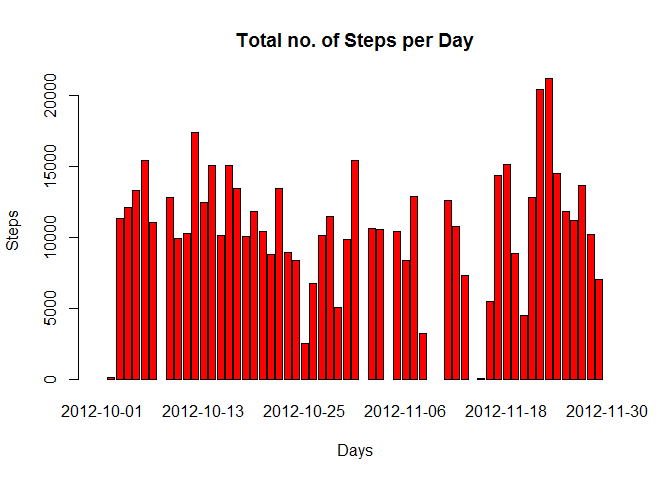
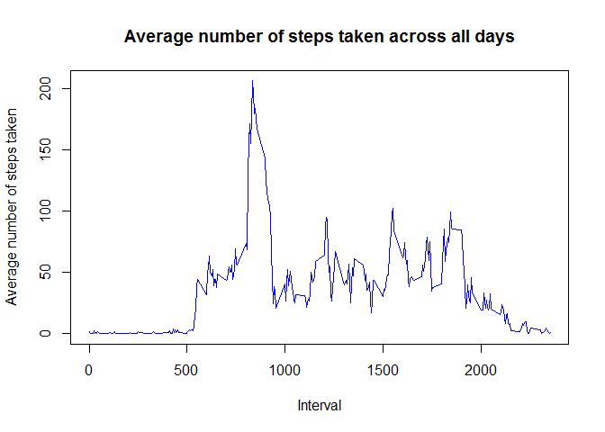
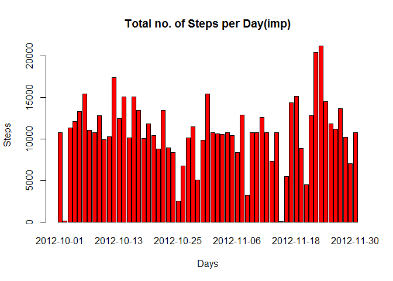
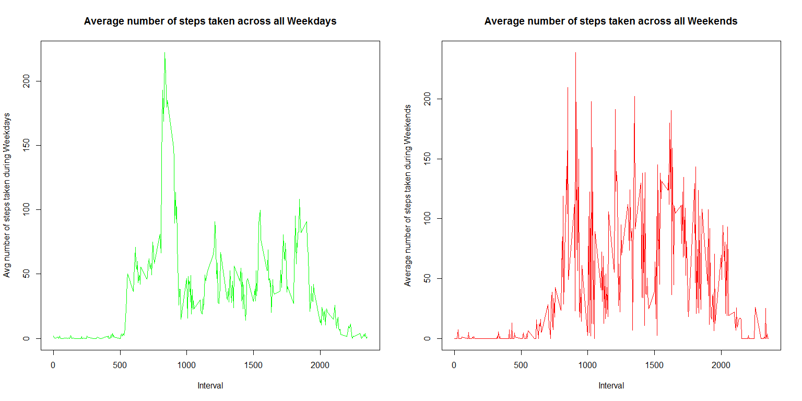

Loading and Processing data to find out the mean total number of steps taken per day
------------------------------------------------------------------------------------

    fileUrl <- "https://d396qusza40orc.cloudfront.net/repdata%2Fdata%2Factivity.zip"
    download.file(fileUrl, destfile = "data.zip")
    fitdata <- unzip("data.zip")
    fit <- read.csv(fitdata, header = T, na.strings = "NA")
    fit$date <- as.Date(fit$date)
    fit$steps <- as.numeric(as.character(fit$steps))

Histogram of total number of steps each day

    library(dplyr)

    ## Warning: package 'dplyr' was built under R version 3.2.5

    ## 
    ## Attaching package: 'dplyr'

    ## The following objects are masked from 'package:stats':
    ## 
    ##     filter, lag

    ## The following objects are masked from 'package:base':
    ## 
    ##     intersect, setdiff, setequal, union

    fit <- fit %>% group_by(date) %>% summarise(steps = sum(steps))
    SD.png <- barplot(fit$steps, names.arg = fit$date, main = "Total no. of Steps per Day", xlab = "Days", ylab = "Steps", col="red")

Mean and Median of total number of steps taken per day

    mean(fit$steps, na.rm = T)

    ## [1] 10766.19

    median(fit$steps, na.rm = T)

    ## [1] 10765

What is the average daily activity pattern?
-------------------------------------------

Plot of the 5-minute interval (x-axis) and the average number of steps
taken, averaged across all days (y-axis)

    fit <- read.csv(fitdata, header = T, na.strings = "NA")
    fit$date <- as.Date(fit$date)
    fit$steps <- as.numeric(as.character(fit$steps))
    fit$interval <- as.numeric(as.character(fit$interval))
    fit <- na.omit(fit)
    library(dplyr)
    fit <- fit %>% group_by(interval) %>% summarise(steps = mean(steps))
    TS.png <- plot(fit$interval, fit$steps, type = 'l', col = "blue", main="Average number of steps taken across all days", xlab="Interval", 
         ylab="Average number of steps taken")

The 5-minute interval on average across all the days in the dataset,
that contains the maximum number of steps

    fit[which.max(fit$steps),1]

    ## # A tibble: 1 × 1
    ##   interval
    ##      <dbl>
    ## 1      835

Imputing missing values
-----------------------

Total number of missing values in the dataset and in each column

    fit <- read.csv(fitdata, header = T, na.strings = "NA")
    fit$date <- as.Date(fit$date)
    fit$steps <- as.numeric(as.character(fit$steps))
    fit$interval <- as.numeric(as.character(fit$interval))
    sum(is.na(fit))

    ## [1] 2304

    sum(is.na(fit$steps))

    ## [1] 2304

    sum(is.na(fit$date))

    ## [1] 0

    sum(is.na(fit$interval))

    ## [1] 0

Strategy to impute missing values for steps with the mean at each
interval across all days and create a new dataset

    impute.mean <- function(x) replace(x, is.na(x), mean(x, na.rm = TRUE))
    fitimp <- fit %>%  group_by(interval) %>% mutate(steps = impute.mean(steps))

Histogram of the total number of steps taken each day (after imputing)

    library(dplyr)
    fitimp <- fitimp %>% group_by(date) %>% summarise(steps = sum(steps))
    SDimp.png <- barplot(fitimp$steps, names.arg = fitimp$date, main = "Total no. of Steps per Day(imp)", xlab = "Days", ylab = "Steps", col="red")

Mean and Median of total number of steps taken per day (after imputing)

    mean(fitimp$steps, na.rm = T)

    ## [1] 10766.19

    median(fitimp$steps, na.rm = T)

    ## [1] 10766.19

Are there differences in activity patterns between weekdays and weekends?
-------------------------------------------------------------------------

Create a factor variable in the dataset to indicate the weekday
corresponding to the dates

    fit <- read.csv(fitdata, header = T, na.strings = "NA")
    fit$date <- as.Date(fit$date)
    fit$steps <- as.numeric(as.character(fit$steps))
    fit$interval <- as.numeric(as.character(fit$interval))
    fit$day <- weekdays(as.Date(fit$date))

Plot containing a time series plot of the 5-minute interval (x-axis) and
the average number of steps taken, averaged across all weekday days or
weekend days (y-axis)

    fitweekday <- fit[!fit$day == c("Saturday", "Sunday"),]
    fitweekend <- fit[fit$day == c("Saturday", "Sunday"),]
    fitweekday <- na.omit(fitweekday)
    fitweekend <- na.omit(fitweekend)
    library(dplyr)
    fitweekday <- fitweekday %>% group_by(interval) %>% summarise(steps = mean(steps))
    fitweekend <- fitweekend %>% group_by(interval) %>% summarise(steps = mean(steps))
    par(mfrow = c(1,2))
    plot(fitweekday$interval, fitweekday$steps, type = 'l', col = "green", main="Average number of steps taken across all Weekdays", xlab="Interval", 
         ylab="Avg number of steps taken during Weekdays")
    plot(fitweekend$interval, fitweekend$steps, type = 'l', col = "red", main="Average number of steps taken across all Weekends", xlab="Interval", 
         ylab="Average number of steps taken during Weekends")

